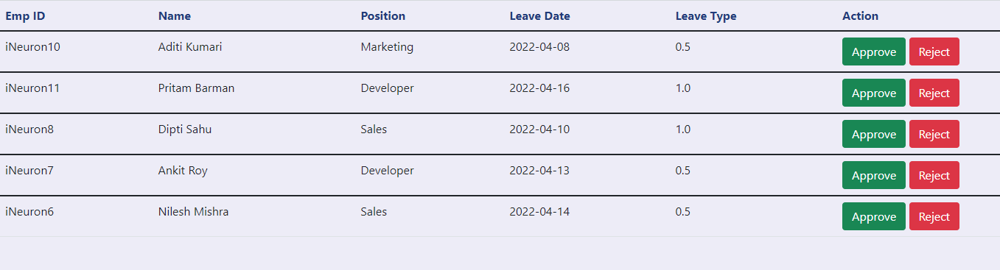

# Leave-Management-System

- With the help of this system admin can add, remove, update employee's information and can approve or reject their leaves
- Employee's can apply for leave, check leave status and claim money 


# Application Link
https://leave-management-application.herokuapp.com/

# Project Demo
https://youtu.be/FXWDncjgy4U

# Documents
HLD/LLD/Architecture/Wireframe/DPR - https://drive.google.com/drive/folders/1qkGCevXZA3GA-fF9Ibx_tlJNTd6qtCj3?usp=sharing

# Database
Cassandra database has been used to store information of employee and for logging
# :desktop_computer:	 Installation
### :hammer_and_wrench: Requirements
- python 3.x
- Flask
- pandas
- APScheduler
- cassandra-driver
# :gear:	 Setup
1. Install Flask:

```pip install Flask```

2. Install pandas:

```pip install pandas```

3. Install APScheduler:

```pip install APScheduler```

4. Install cassandra-driver

```pip install cassandra-driver```

# Contributor
- Sayan Saha
